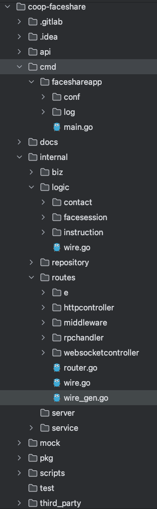

# KS服务端的整洁代码架构实践




```text
.
├── Dockerfile // 
├── Makefile
├── README.md
├── api
│   └── README.md
├── cmd
│   └── faceshareapp
│       ├── conf
│       │   ├── README.md
│       │   ├── app.json
│       │   ├── app.json.template
│       │   ├── app.yaml
│       │   ├── app.yaml.template
│       │   └── go-klion-dev+default+application.properties
│       ├── log
│       │   └── faceshareapp.log
│       └── main.go
├── cover.out
├── dir.txt
├── docs
│   ├── docs.md
│   └── pic
│       ├── img1.png
│       └── img2.png
├── go.mod
├── go.sum
├── internal
│   ├── biz
│   │   ├── constant
│   │   │   ├── README.md
│   │   │   ├── constant.go
│   │   │   └── ctxutils.go
│   │   ├── domain
│   │   │   ├── contact
│   │   │   │   └── README.md
│   │   │   ├── facesession
│   │   │   │   ├── README.md
│   │   │   │   ├── facesession.go
│   │   │   │   └── facesession_doc.go
│   │   │   └── instruction
│   │   │       ├── README.md
│   │   │       └── instruction.go
│   │   ├── protos
│   │   │   ├── facesharehttpobj
│   │   │   │   ├── facesharehttpobj.pb.go
│   │   │   │   ├── facesharehttpobj.pb.validate.go
│   │   │   │   └── facesharehttpobj.proto
│   │   │   └── instruction
│   │   │       ├── instruction.pb.go
│   │   │       ├── instruction.proto
│   │   │       ├── instruction_grpc.pb.go
│   │   │       └── mock_instruction
│   │   │           └── mock_instruction.go
│   │   ├── request
│   │   │   └── request.go
│   │   └── response
│   │       ├── response.go
│   │       └── response_test.go
│   ├── logic
│   │   ├── contact
│   │   │   ├── contactsbatchread.go
│   │   │   ├── contactscreate.go
│   │   │   ├── logic.go
│   │   │   ├── pushtemplateaction.go
│   │   │   └── wire.go
│   │   ├── facesession
│   │   │   ├── facesessioncreate.go
│   │   │   ├── facesessionquit.go
│   │   │   ├── facesessionsearch.go
│   │   │   ├── facesessiontoken.go
│   │   │   ├── filesbatchread.go
│   │   │   ├── filescreate.go
│   │   │   ├── filesdelete.go
│   │   │   ├── invokelink.go
│   │   │   ├── logic.go
│   │   │   ├── numcode.go
│   │   │   ├── prejoin.go
│   │   │   └── wire.go
│   │   ├── instruction
│   │   │   ├── connclient
│   │   │   │   ├── connclient.go
│   │   │   │   └── msg.go
│   │   │   ├── exec
│   │   │   │   ├── event_ackheart.go
│   │   │   │   ├── event_actionsync.go
│   │   │   │   ├── event_cancelautoend.go
│   │   │   │   ├── event_cancelfollow.go
│   │   │   │   ├── event_cancelfollowme.go
│   │   │   │   ├── event_filecreate.go
│   │   │   │   ├── event_filedelete.go
│   │   │   │   ├── event_followchange.go
│   │   │   │   ├── event_followme.go
│   │   │   │   ├── event_followother.go
│   │   │   │   ├── event_httpquit.go
│   │   │   │   ├── event_memberchange.go
│   │   │   │   ├── event_memberjoin.go
│   │   │   │   ├── event_quit.go
│   │   │   │   ├── event_sessend.go
│   │   │   │   ├── event_sessionautoend.go
│   │   │   │   ├── event_sysheart.go
│   │   │   │   └── executor.go
│   │   │   ├── logic.go
│   │   │   ├── mgr
│   │   │   │   ├── mock_mgr
│   │   │   │   │   ├── README.md
│   │   │   │   │   ├── mock_pointlocationmgr.go
│   │   │   │   │   └── mock_pointmemmgr.go
│   │   │   │   ├── pointlocationmgr.go
│   │   │   │   └── pointmemmgr.go
│   │   │   ├── transport
│   │   │   │   ├── instructionproxy.go
│   │   │   │   └── instructionproxy_test.go
│   │   │   └── wire.go
│   │   └── wire.go
│   ├── repository
│   │   ├── cache_dataobj.go
│   │   ├── cache_repo.go
│   │   ├── constant.go
│   │   ├── db_repo.go
│   │   ├── facecorntask_cache_repo.go
│   │   ├── facecorntasklock_cache_repo.go
│   │   ├── facesession_db_repo.go
│   │   ├── facesession_rache_repo.go
│   │   ├── facesessiondoc_db_repo.go
│   │   ├── point_cache_repo.go
│   │   ├── pushtemplate_cache_repo.go
│   │   └── wire.go
│   ├── routes
│   │   ├── e
│   │   │   └── errors.go
│   │   ├── httpcontroller
│   │   │   └── faceshare_controller.go
│   │   ├── middleware
│   │   │   ├── accountauthhandle.go
│   │   │   └── wsauthhandler.go
│   │   ├── router.go
│   │   ├── rpchandler
│   │   │   └── faceshare_handler.go
│   │   ├── websocketcontroller
│   │   │   └── faceshare_wscontroller.go
│   │   ├── wire.go
│   │   └── wire_gen.go
│   ├── server
│   └── service
│       ├── driveservice.go
│       ├── encsservice.go
│       ├── idgenerator.go
│       ├── notifyservice.go
│       ├── notifyservice_test.go
│       └── wire.go
├── kaq_build.sh
├── main
├── mock
│   └── conf
│       └── test1.yaml
├── pkg
│   ├── README.md
│   ├── accountapi
│   │   ├── accountapi.go
│   │   ├── accountapi_test.go
│   │   ├── config.go
│   │   └── proto
│   │       └── coopcontactapp
│   │           ├── coopcontactapp.pb.go
│   │           ├── coopcontactapp.pb.validate.go
│   │           ├── coopcontactapp.proto
│   │           └── coopcontactapp_grpc.pb.go
│   ├── auth
│   │   └── auth.go
│   ├── driveapi
│   │   ├── agent.go
│   │   ├── agent_test.go
│   │   ├── model.go
│   │   └── sign.go
│   ├── encsapi
│   │   ├── agent.go
│   │   ├── agent_test.go
│   │   └── model.go
│   ├── entrance
│   │   ├── client
│   │   │   └── client_ws.go
│   │   └── pack
│   │       └── pack.go
│   ├── errhandle
│   │   └── recover.go
│   ├── gorm
│   │   └── gorm.go
│   ├── metric
│   │   └── httpclient.go
│   ├── network
│   │   └── ip.go
│   ├── notifyapi
│   │   ├── agent.go
│   │   └── model.go
│   ├── pasetotoken
│   │   └── paseto.go
│   ├── validatecode
│   │   └── common.go
│   ├── workerid
│   │   ├── snowid.go
│   │   ├── workerid.go
│   │   ├── workeridgen.go
│   │   └── workeridgen_test.go
│   └── wps2sign
│       ├── sign.go
│       └── sign_test.go
├── scripts
│   ├── build
│   │   └── build.sh
│   └── start
│       └── start.sh
├── sonar-project.properties
├── test
├── third_party
│   ├── google
│   │   └── api
│   │       ├── annotations.proto
│   │       ├── http.proto
│   │       └── httpbody.proto
│   └── validate
│       └── validate.proto
└── vendor
    ├── bou.ke


```