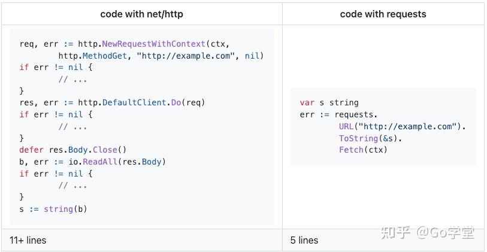
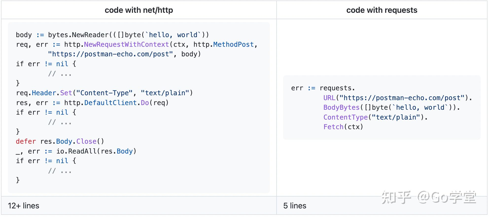
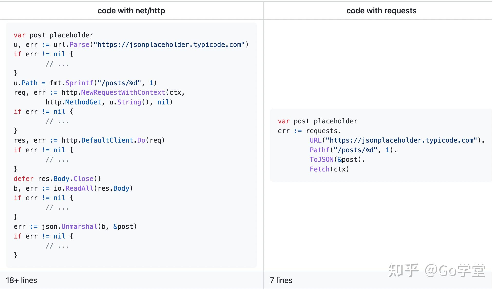
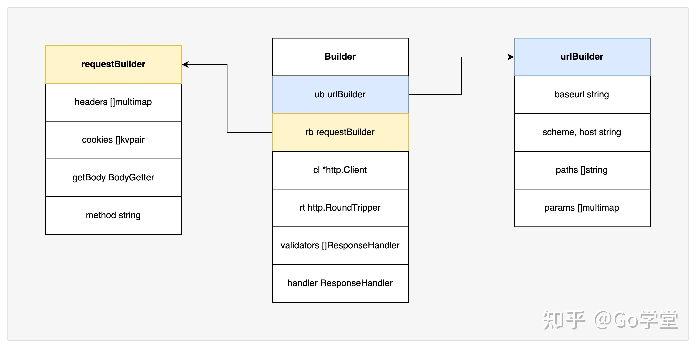
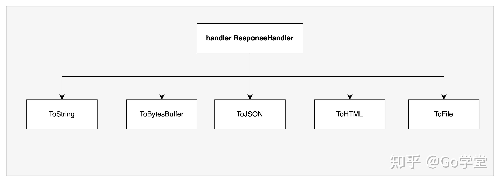

# 官网
https://github.com/carlmjohnson/requests

```bash
go get -u github.com/carlmjohnson/requests
```
依赖：Go 1.20

# 该包诞生的背景
作者在自己的博客中描述了自己为什么写这个request包。作者这样描述go的net/http包：

Go的net/http包虽然功能强大、用途也广泛，但要想正确的使用请求的客户端是非常繁琐的。

我们看下go的net/http包在发送一个web请求时有哪些繁琐的地方。以下是使用标准的net/http包发送请求的一个示例：
```go
func GetFoo() (*T, error) {
res, err := http.Get("http://foo/t.json")
if err != nil {
return nil, err
}
t := new(T)
if err := json.NewDecoder(res.Body).Decode(t); err != nil {
return nil, err
}
return t, nil
}
```
这段代码有如下问题：
* 没有调用Response.Body.Close关闭连接
* 没有检查响应返回的状态值
* 响应值是字节切片，没有做对应的结构转换

* 这会导致正确使用GetFoo函数应该看起来像下面这样：

```go
func GetFoo(ctx context.Context) (*T, error) {
req, err := http.NewRequest("GET", "http://foo/t.json", nil)
if err != nil {
return nil, err
}
req = req.WithContext(ctx)
res, err := http.DefaultClient.Do(req)
if err != nil {
return nil, err
}
defer res.Body.Close()
if res.StatusCode < 200 || res.StatusCode > 299 {
return nil, fmt.Errorf("bogus status: got %v", res.Status)
}
t := new(T)
if err := json.NewDecoder(res.Body).Decode(t); err != nil {
return nil, err
}
return t, nil
}
```

就是要增加对Context的支持、关闭Response.Body、检查响应的返回值以及对响应值转换成json（或其他格式）。

所以，作者才写了自己的requests库，目的是要让http的请求不再繁琐。

# Requests包的使用
基于以上问题，requests包就诞生了。该包通过将发送请求时的所有必要信息都抽象成了Builder结构体，通过该结构体来构建、发送和处理HTTP的请求。并且还支持链式操作。

下面我们看一些具体的请求示例。

Get请求，响应结果解析成字符串
如下，是发送Get的请求。使用requests包发送Get请求只需要5行代码，而原生的net/http包得需要11多行代码。




Post请求
如下，是一个发送Post的请求。使用requests包只用了5行代码，而原生的net/http包需要12多行代码。




将Get请求的JSON结果转换成结构体
如下，是Get请求的JSON响应结果解析成对应的结构体。使用requests包只用了7行代码，而使用原生的net/http包需要使用18多行代码。



发送Body是JSON的Post请求
将JSON请求体以POST方式发送的代码也很简洁，如下：


# 实现原理
该包实现的原理是利用了封装的思想。将复杂的操作封装到函数中，对外暴露接口供使用者调用。

在requests包中，最核心的是是一个Builder的结构。该结构体将请求的URL、请求的参数、http的客户端以及响应结果处理函数都封装在这里该结构体中。如下：




urlBuilder结构体的功能是构造请求的URL
requestBuilder结构体的功能是构造请求头、cookie、请求方法等信息
http.Client是http请求的客户端
ResponseHandler结构体的功能是处理请求的响应值。
下图是ResjponseHandler结构体处理响应值的函数实现。能处理成JSON、文件、HTML等多种格式。




总结
requensts包利用“封装”的思想，将复杂的处理操作封装到函数中，一是避免调用者编写重复的代码，提高效率；二是能够减少调用者出错的概率。在实际研发中，我们也可以借鉴其思想，将常用的操作封装起来，从而提高研发效率。